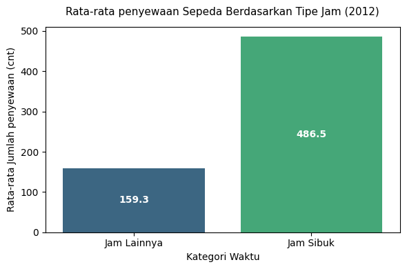
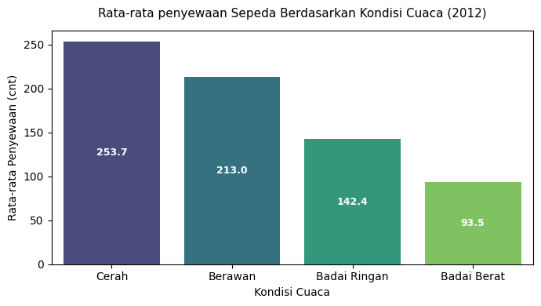
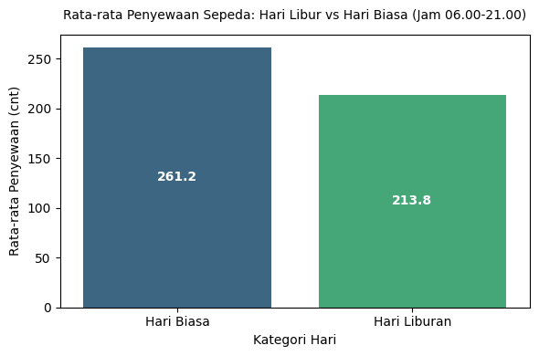

# Dashboard Analisis Data Penyewaan Sepeda 🚲

## 📌 Deskripsi Proyek

Proyek ini merupakan analisis data terhadap **Bike Sharing Dataset**, yaitu dataset yang berisi informasi mengenai jumlah penyewaan sepeda berdasarkan waktu, kondisi cuaca, hari kerja, hari libur, serta karakteristik pengguna.

Analisis dilakukan untuk memahami **pola penggunaan sepeda dan faktor-faktor yang berkaitan dengan jumlah penyewaan**, khususnya pada jam sibuk, kondisi cuaca, serta hari libur.

Hasil analisis kemudian divisualisasikan dalam bentuk **dashboard interaktif menggunakan Streamlit** sehingga informasi dan insight dari dataset dapat lebih mudah dieksplorasi.

---

## 🎯 Pertanyaan Bisnis

Analisis ini dilakukan untuk menjawab beberapa pertanyaan bisnis berikut:

### Pertanyaan 1
**Berapa besar persentase peningkatan rata-rata jumlah peminjaman sepeda (`cnt`) pada jam sibuk/rush hour pagi (07.00–09.00) dan sore (16.00–18.00) dibandingkan jam-jam lainnya pada hari kerja (`workingday = 1`) sepanjang tahun 2012?**

### Pertanyaan 2
**Kondisi cuaca mana (`weathersit`: Level 1 Cerah, Level 2 Berawan, atau Level 3/4 Badai) yang menghasilkan rata-rata jumlah peminjaman sepeda (`cnt`) harian tertinggi sepanjang tahun 2012?**

### Pertanyaan 3
**Berapa selisih rata-rata jumlah penyewaan sepeda (`cnt`) antara hari libur (`holiday`) dan hari biasa pada rentang jam 06.00–21.00 sepanjang tahun 2011 dan 2012?**

---

## 📊 Dataset

Dataset yang digunakan adalah **Bike Sharing Dataset** dari:

**Hadi Fanaee-T**  
Laboratory of Artificial Intelligence and Decision Support (LIAAD), University of Porto  
INESC Porto, Portugal

Diunduh dari [Kaggle](https://www.kaggle.com/datasets/lakshmi25npathi/bike-sharing-dataset)

Dataset terdiri dari dua file utama:

- `hour.csv` — data penyewaan sepeda yang diagregasi berdasarkan jam, dengan **17.379 records**
- `day.csv` — data penyewaan sepeda yang diagregasi berdasarkan hari, dengan **731 records**


### Variabel Dataset

| Kolom | Deskripsi |
|---|---|
| `instant` | Record index |
| `dteday` | Tanggal |
| `season` | Musim (1: Spring, 2: Summer, 3: Fall, 4: Winter) |
| `yr` | Tahun (0: 2011, 1: 2012) |
| `mnth` | Bulan (1–12) |
| `hr` | Jam (0–23), hanya tersedia pada `hour.csv` |
| `holiday` | Indikator hari libur |
| `weekday` | Hari dalam minggu |
| `workingday` | Indikator hari kerja |
| `weathersit` | Kondisi cuaca |
| `temp` | Suhu yang telah dinormalisasi |
| `atemp` | Feels-like temperature yang telah dinormalisasi |
| `hum` | Kelembapan yang telah dinormalisasi |
| `windspeed` | Kecepatan angin yang telah dinormalisasi |
| `casual` | Jumlah pengguna casual |
| `registered` | Jumlah pengguna registered |
| `cnt` | Total penyewaan sepeda |

### Kategori Cuaca

`weathersit` terdiri dari:

- **Level 1 — Cerah:** Clear, Few clouds, Partly cloudy
- **Level 2 — Berawan:** Mist + Cloudy, Mist + Broken clouds, Mist + Few clouds, Mist
- **Level 3 — Badai Ringan:** Light Snow, Light Rain + Thunderstorm + Scattered clouds, Light Rain + Scattered clouds
- **Level 4 — Badai Berat:** Heavy Rain + Ice Pallets + Thunderstorm + Mist, Snow + Fog

### 📚 Dataset Reference

Dataset ini dikembangkan oleh **Hadi Fanaee-T dan Joao Gama**.

> Fanaee-T, Hadi, and Gama, Joao. "Event labeling combining ensemble detectors and background knowledge." Progress in Artificial Intelligence (2013): 1–15. Springer Berlin Heidelberg.

**DOI:** 10.1007/s13748-013-0040-3


---
# 🛢 Data Wrangling

## 🔎 Data Assessment

Dataset terdiri dari dua DataFrame:

- `day_df` → berasal dari `day.csv`
- `hour_df` → berasal dari `hour.csv`

### `day_df`

- 731 records
- 16 kolom
- Tidak terdapat missing value
- Tidak terdapat duplicated value
- Tidak ditemukan inaccurate value
- Kolom `dteday` masih bertipe `object` dan perlu dikonversi menjadi `datetime`

### `hour_df`

- 17.379 records
- 17 kolom
- Tidak terdapat missing value
- Tidak terdapat duplicated value
- Tidak ditemukan inaccurate value
- Kolom `dteday` masih bertipe `object` dan perlu dikonversi menjadi `datetime`

---

## 🧹 Data Cleaning

Tahapan data cleaning yang dilakukan meliputi:

1. Mengubah tipe data kolom `dteday` pada `day_df` dan `hour_df` menjadi `datetime`.
2. Memastikan tidak terdapat missing value pada dataset.
3. Memastikan tidak terdapat data duplikat.
4. Melakukan pengecekan terhadap nilai `cnt`.
5. Memastikan bahwa:

```text
cnt = casual + registered
```

---

# 📈 Exploratory Data Analysis

## 1. Analisis Rush Hour pada Hari Kerja Tahun 2012

Analisis pertama dilakukan menggunakan `hour_df` dengan memfilter:

- Tahun 2012 (`yr = 1`)
- Hari kerja (`workingday = 1`)
- Rush hour pagi: **07.00–09.00**
- Rush hour sore: **16.00–18.00**

Hasil analisis:

| Periode | Rata-rata Penyewaan |
|---|---:|
| Jam lainnya | 159,26 |
| Rush Hour | 486,48 |

Peningkatan rata-rata:

**327,22 penyewaan atau sekitar 205,46%.**



### 💡 Insight

Rata-rata penyewaan sepeda pada jam rush hour jauh lebih tinggi dibandingkan jam lainnya pada hari kerja tahun 2012.

Hal ini menunjukkan adanya **lonjakan permintaan yang sangat signifikan pada periode pagi dan sore**, yang kemungkinan berkaitan dengan aktivitas perjalanan masyarakat seperti berangkat dan pulang kerja.

---

## 2. Analisis Pengaruh Kondisi Cuaca Tahun 2012

Analisis kedua dilakukan untuk membandingkan rata-rata jumlah penyewaan berdasarkan kondisi cuaca pada tahun 2012.

| Kondisi Cuaca | Rata-rata Penyewaan |
|---|---:|
| Cerah | 253,66 |
| Berawan | 212,99 |
| Badai Ringan | 142,37 |
| Badai Berat | 93,50 |



### 💡 Insight

Kondisi **cuaca cerah menghasilkan rata-rata penyewaan sepeda tertinggi**, yaitu sebesar **253,66 penyewaan**.

Semakin buruk kondisi cuaca, rata-rata jumlah penyewaan cenderung semakin menurun. Pada kondisi badai berat, rata-rata penyewaan hanya mencapai **93,50 penyewaan**.

Hal ini menunjukkan bahwa **kondisi cuaca merupakan salah satu faktor yang berkaitan dengan tingkat permintaan penyewaan sepeda.**

---

## 3. Analisis Hari Libur dan Hari Biasa

Analisis ketiga dilakukan pada rentang waktu **06.00–21.00** sepanjang tahun 2011 dan 2012.

| Jenis Hari | Rata-rata Penyewaan |
|---|---:|
| Hari biasa | 261,23 |
| Hari libur | 213,76 |

Selisih rata-rata:

**47,46 penyewaan.**

Persentase penurunan pada hari libur:

**18,17%.**



### 💡 Insight

Rata-rata penyewaan sepeda pada hari libur lebih rendah dibandingkan hari biasa.

Pada rentang jam 06.00–21.00, jumlah penyewaan pada hari libur rata-rata **47,46 unit lebih rendah**, atau sekitar **18,17% lebih rendah** dibandingkan hari biasa.

---

# 🔍 Analisis Lanjutan

Selain menjawab pertanyaan bisnis utama, dilakukan beberapa analisis tambahan untuk mendapatkan pemahaman yang lebih mendalam mengenai pola penyewaan sepeda.

## 1. Rata-rata Penyewaan Berdasarkan Hari

Rata-rata penyewaan berdasarkan hari dalam minggu:

| Hari | Rata-rata Penyewaan |
|---|---:|
| Minggu | 4.228,82 |
| Senin | 4.338,12 |
| Selasa | 4.510,66 |
| Rabu | 4.548,53 |
| Kamis | 4.667,25 |
| Jumat | 4.690,28 |
| Sabtu | 4.550,54 |

### 💡 Insight

Jumlah penyewaan sepeda relatif **stabil sepanjang hari dalam seminggu**, tetapi terdapat sedikit perbedaan antarhari.

Rata-rata penyewaan tertinggi terdapat pada **hari Jumat**, yaitu sebesar **4.690,28 penyewaan**, sedangkan rata-rata terendah terdapat pada **hari Minggu**, yaitu sebesar **4.228,82 penyewaan**.

### 🎯 Action Item

- Meningkatkan kesiapan armada menjelang akhir minggu, terutama pada **hari Jumat**.
- Memanfaatkan tingginya aktivitas penyewaan pada Jumat untuk menjalankan program promosi atau membership.
- Melakukan promosi khusus pada akhir pekan untuk meningkatkan permintaan pada hari dengan rata-rata penyewaan lebih rendah.

---

## 2. Rata-rata Penyewaan Berdasarkan Jam

Pola penyewaan berdasarkan jam menunjukkan adanya periode dengan tingkat permintaan yang berbeda-beda.

| Jam | Rata-rata |
|---|---:|
| 00.00 | 53,90 |
| 01.00 | 33,38 |
| 02.00 | 22,87 |
| 03.00 | 11,73 |
| 04.00 | 6,35 |
| 05.00 | 19,89 |
| 06.00 | 76,04 |
| 07.00 | 212,06 |
| 08.00 | 359,01 |
| 09.00 | 219,31 |
| 10.00 | 173,67 |
| 11.00 | 208,14 |
| 12.00 | 253,32 |
| 13.00 | 253,66 |
| 14.00 | 240,95 |
| 15.00 | 251,23 |
| 16.00 | 311,98 |
| 17.00 | 461,45 |
| 18.00 | 425,51 |
| 19.00 | 311,52 |
| 20.00 | 226,03 |
| 21.00 | 172,31 |
| 22.00 | 131,34 |
| 23.00 | 87,83 |

### 💡 Insight

Terdapat pola yang jelas pada penggunaan sepeda berdasarkan waktu.

- **Top 50%:** jam 07, 08, 09, 12, 13, 14, 15, 16, 17, 18, 19, dan 20.
- **Top 25%:** jam 08, 13, 16, 17, 18, dan 19.
- **Top 10%:** jam 08, 17, dan 18.
- Jam dengan penyewaan tertinggi adalah **17.00**, dengan rata-rata **461,45 penyewaan**, diikuti jam 18.00 sebesar **425,51** dan jam 08.00 sebesar **359,01**.

Pola ini memperkuat temuan pada analisis rush hour bahwa **jam berangkat dan pulang kerja merupakan periode dengan permintaan tertinggi.**

### 🎯 Action Item

- Memastikan ketersediaan sepeda dan kapasitas stasiun pada pukul **07.00–09.00 dan 16.00–19.00**.
- Menempatkan lebih banyak armada pada area yang berpotensi menjadi titik keberangkatan dan tujuan pengguna pada jam sibuk.
- Menjadwalkan maintenance pada jam dengan permintaan rendah, terutama sekitar **02.00–05.00**, untuk meminimalkan gangguan terhadap pengguna.
- Menawarkan promo pada jam dengan permintaan rendah untuk membantu meningkatkan utilisasi armada.

---

## 3. Hubungan Feels-Like Temperature dengan Penyewaan

Suhu feels-like dikategorikan menjadi:

| Kategori | Rentang |
|---|---|
| Sangat Dingin | 0–15°C |
| Sejuk | 15–20°C |
| Ideal | 20–27°C |
| Panas | >27°C |

Hasil analisis:

| Kategori | Rata-rata Penyewaan |
|---|---:|
| Sangat Dingin | 84,29 |
| Sejuk | 137,97 |
| Ideal | 183,98 |
| Panas | 263,70 |

### 💡 Insight

Rata-rata penyewaan meningkat seiring dengan meningkatnya suhu feels-like pada dataset.

Kategori **Panas** memiliki rata-rata penyewaan tertinggi sebesar **263,70**, sedangkan kategori **Sangat Dingin** memiliki rata-rata terendah sebesar **84,29**.

### 🎯 Action Item

- Meningkatkan kesiapan armada ketika kondisi suhu lebih hangat karena permintaan cenderung lebih tinggi.
- Memanfaatkan periode dengan suhu hangat sebagai momentum untuk menjalankan promosi atau kampanye penyewaan.
- Mempertimbangkan kondisi suhu dalam perencanaan kapasitas armada dan operasional.

---

## 4. Hubungan Kelembapan dengan Penyewaan

Kelembapan dikategorikan menjadi:

| Kategori | Rentang |
|---|---|
| Rendah | 0–40% |
| Sedang | 40–60% |
| Tinggi | >60% |

Hasil analisis:

| Kategori | Rata-rata Penyewaan |
|---|---:|
| Rendah | 285,72 |
| Sedang | 221,75 |
| Tinggi | 145,18 |

### 💡 Insight

Rata-rata penyewaan sepeda lebih tinggi ketika tingkat kelembapan berada pada kategori **Rendah**.

Sebaliknya, ketika kelembapan tinggi, rata-rata penyewaan menurun hingga **145,18 penyewaan**.

Hal ini menunjukkan adanya hubungan antara kondisi kelembapan dengan tingkat penggunaan sepeda.

### 🎯 Action Item

- Mengantisipasi penurunan permintaan ketika kelembapan tinggi dengan menggunakan strategi promosi yang sesuai.
- Mengoptimalkan ketersediaan armada pada kondisi kelembapan rendah ketika permintaan cenderung lebih tinggi.
- Menggabungkan informasi kelembapan dengan faktor cuaca lainnya untuk membuat perencanaan permintaan yang lebih akurat.

---

## 5. Hubungan Kecepatan Angin dengan Penyewaan

Kecepatan angin dikategorikan menjadi:

| Kategori | Rentang |
|---|---|
| Light | 0–5 km/jam |
| Breeze | 5–49 km/jam |
| Gale | 49–88 km/jam |
| Storm | >88 km/jam |

Hasil analisis:

| Kategori | Rata-rata Penyewaan |
|---|---:|
| Light | 160,64 |
| Breeze | 193,62 |
| Gale | 140,88 |
| Storm | Tidak tersedia |

### 💡 Insight

Rata-rata penyewaan tertinggi terdapat pada kategori **Breeze**, yaitu sebesar **193,62 penyewaan**.

Pada kategori **Gale**, rata-rata penyewaan menurun menjadi **140,88 penyewaan**.

Tidak terdapat observasi pada kategori **Storm**, sehingga tidak dapat dilakukan perbandingan untuk kategori tersebut.

### 🎯 Action Item

- Mempertimbangkan kecepatan angin sebagai salah satu faktor dalam perencanaan operasional.
- Memanfaatkan kondisi angin yang relatif nyaman untuk mendorong aktivitas penyewaan.
- Mengantisipasi penurunan permintaan pada kondisi angin yang lebih kuat.
- Tidak membuat kesimpulan bisnis mengenai kategori Storm karena dataset tidak memiliki observasi pada kategori tersebut.

---

## 6. Perbandingan Pengguna Casual dan Registered Berdasarkan Hari Kerja

Rata-rata pengguna berdasarkan `workingday`:

| Hari | Casual | Registered |
|---|---:|---:|
| Hari libur/weekend | 1.371,13 | 2.959,03 |
| Hari kerja | 606,57 | 3.978,25 |

### 💡 Insight

Terdapat pola yang berbeda antara pengguna **casual** dan **registered**.

- Pengguna **casual** memiliki rata-rata penyewaan lebih tinggi pada hari libur/weekend.
- Pengguna **registered** memiliki rata-rata penyewaan lebih tinggi pada hari kerja.

Hal ini menunjukkan bahwa kedua segmen pengguna memiliki pola penggunaan yang berbeda.

Pengguna registered cenderung lebih aktif pada hari kerja, sedangkan pengguna casual memiliki aktivitas yang relatif lebih tinggi pada hari libur/weekend.

### 🎯 Action Item

- Menargetkan pengguna **registered** dengan program membership, subscription, atau benefit perjalanan pada hari kerja.
- Menargetkan pengguna **casual** dengan promosi rekreasi dan paket weekend.
- Mengembangkan strategi pemasaran yang berbeda untuk masing-masing segmen pengguna.
- Menyesuaikan distribusi armada berdasarkan karakteristik pengguna dan jenis hari.

---

# 📌 Kesimpulan

Berdasarkan hasil analisis, dapat diperoleh beberapa kesimpulan utama:

### Pertanyaan 1

Rata-rata penyewaan sepeda pada tahun 2012 selama **rush hour (07.00–09.00 dan 16.00–18.00)** lebih tinggi dibandingkan jam lainnya pada hari kerja.

Rata-rata penyewaan meningkat dari **159,26** menjadi **486,48 penyewaan**, atau meningkat sebesar **327,22 penyewaan (205,46%)**.

### Pertanyaan 2

Kondisi cuaca **cerah** menghasilkan rata-rata penyewaan tertinggi pada tahun 2012, yaitu **253,66 penyewaan**.

Rata-rata penyewaan kemudian menurun pada kondisi berawan (**212,99**), badai ringan (**142,37**), dan badai berat (**93,50**).

### Pertanyaan 3

Pada rentang jam **06.00–21.00**, rata-rata penyewaan pada hari libur adalah **213,76**, sedangkan pada hari biasa sebesar **261,23**.

Dengan demikian, terdapat selisih sebesar **47,46 penyewaan**, atau penurunan sekitar **18,17%** pada hari libur.

---

# 💡 Rekomendasi Action Item

Berdasarkan seluruh hasil analisis, beberapa rekomendasi yang dapat diberikan adalah:

### 1. Optimasi Armada pada Rush Hour

- Meningkatkan ketersediaan sepeda pada pukul **07.00–09.00 dan 16.00–18.00**.
- Memastikan distribusi sepeda pada titik dengan permintaan tinggi sebelum jam sibuk.
- Melakukan maintenance pada jam dengan permintaan rendah agar tidak mengganggu periode peak demand.

### 2. Strategi Berdasarkan Cuaca

- Meningkatkan kesiapan armada pada kondisi cuaca cerah.
- Menyesuaikan jumlah armada dan operasional ketika terjadi kondisi cuaca buruk.
- Memanfaatkan data cuaca untuk membantu melakukan forecasting permintaan.

### 3. Strategi Hari Libur

- Menyesuaikan jumlah armada dengan permintaan yang lebih rendah pada hari libur.
- Mengarahkan strategi marketing pada area rekreasi, taman kota, dan destinasi wisata.
- Membuat promo khusus weekend/holiday untuk meningkatkan penggunaan oleh pengguna casual.

### 4. Strategi Berdasarkan Waktu

- Memprioritaskan ketersediaan armada pada pukul **08.00, 17.00, dan 18.00** karena merupakan periode dengan rata-rata penyewaan tertinggi.
- Menggunakan periode dini hari dengan permintaan rendah untuk maintenance.
- Memberikan promo off-peak untuk meningkatkan utilisasi armada pada jam sepi.

### 5. Strategi Berdasarkan Kondisi Lingkungan

- Mempertimbangkan suhu, kelembapan, dan kecepatan angin dalam melakukan estimasi permintaan.
- Meningkatkan kapasitas operasional ketika kondisi lingkungan mendukung aktivitas bersepeda.
- Mengurangi ketergantungan pada satu faktor dengan menggabungkan beberapa variabel lingkungan dalam analisis atau forecasting.

### 6. Segmentasi Pengguna

- Mengembangkan program **membership/subscription** untuk pengguna registered yang dominan pada hari kerja.
- Membuat paket rekreasi atau promo weekend untuk pengguna casual.
- Menggunakan pola perilaku masing-masing segmen untuk membuat strategi pemasaran yang lebih terarah.

---

# 🖥️ Dashboard

Hasil analisis data divisualisasikan menggunakan **Streamlit** dan dapat digunakan untuk mengeksplorasi pola penyewaan sepeda berdasarkan waktu, kondisi cuaca, hari, serta faktor lingkungan.

**Dashboard dapat diakses melalui:**

[Streamlit Cloud](https://anlss-dt-bkshrng-ivan.streamlit.app/)

---

# ⚙️ Instalasi dan Menjalankan Dashboard

## 1. Clone Repository

```bash
git clone https://github.com/valselt/proyekanalisisdata_dicoding.git
cd proyekanalisisdata_dicoding
```

## 2. Setup Environment - Anaconda

```bash
conda create --name analisis-data-sepeda python=3.9
conda activate analisis-data-sepeda
```

## 3. Install Dependencies

```bash
pip install -r requirements.txt
```

## 4. Run Streamlit App

```bash
streamlit run dashboard.py
```

Setelah dijalankan, dashboard dapat diakses melalui alamat yang ditampilkan oleh Streamlit.

---


# 🛠️ Tools & Technologies

- **Python**
- **Pandas**
- **NumPy**
- **Matplotlib**
- **Seaborn**
- **Streamlit**
- **Jupyter Notebook**
- **Anaconda**

---

# 👤 Author

**Muhammad Ivan Aldorino**

Teknik Informatika — Universitas Negeri Semarang

Interest: **Data Science • Data Analytics • Computer Vision**